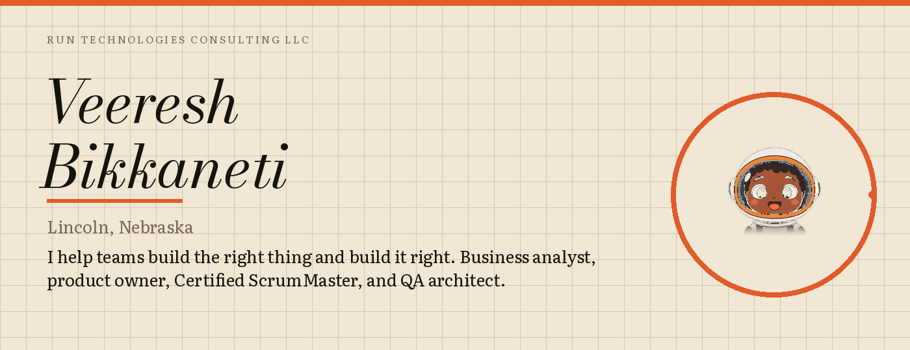
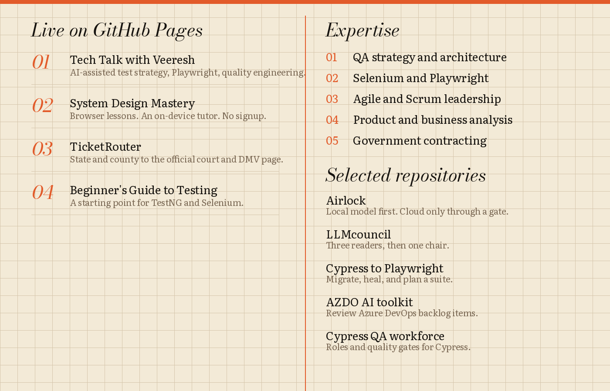

[Site](https://veeresh-bikkaneti.github.io/) · [LinkedIn](https://www.linkedin.com/in/sdetbaveer/) · [Blog](https://veeresh-bikkaneti.github.io/techtalkwith-veeresh/) · [Medium](https://medium.com/@veeresh.esh) · [All repositories](https://github.com/veeresh-bikkaneti?tab=repositories)

[Tech Talk](https://veeresh-bikkaneti.github.io/techtalkwith-veeresh/) · [System Design Mastery](https://veeresh-bikkaneti.github.io/system-design-and-architecture/) · [TicketRouter](https://veeresh-bikkaneti.github.io/TrafficTicketRouter/) · [Beginner's Guide to Testing](https://veeresh-bikkaneti.github.io/beginnersguidefortesting/)

[Airlock](https://github.com/veeresh-bikkaneti/airlock) · [LLMcouncil](https://github.com/veeresh-bikkaneti/LLMcouncil) · [Cypress to Playwright](https://github.com/veeresh-bikkaneti/cypress-playwright) · [AZDO AI toolkit](https://github.com/veeresh-bikkaneti/azdo-ai-toolkit) · [Cypress QA workforce](https://github.com/veeresh-bikkaneti/cypress-qa-ai-workforce)

Open to consulting and government IT work. The astronaut is [page-mascot](https://github.com/nilbuild/page-mascot).
